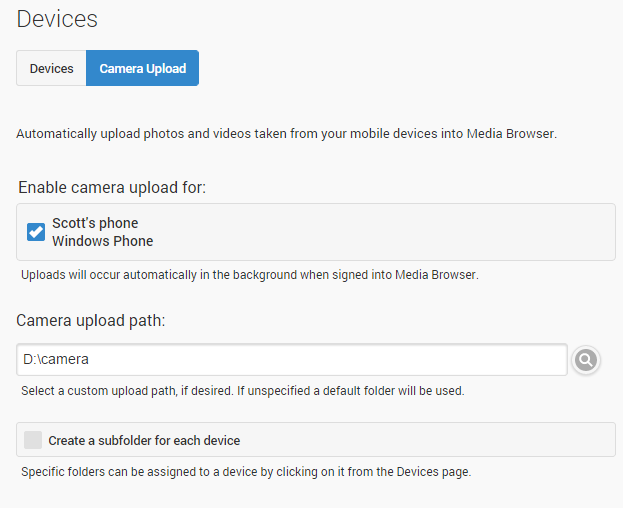

Camera upload allows automatic uploading of photos taken from mobile devices to your Media Browser Server. It requires Media Browser apps installed on your mobile devices as well as for the app to support the feature.

Currently, the apps that support automatic camera upload are:

* Windows 8.1 Store App
* Windows Phone

## Enabling Camera Upload

First open the server dashboard and navigate to **Devices** -> **Camera Upload**.

You'll be presented with a screen that allows you to select which devices to enable it for:

## Customizing the Upload Location

There are a few options that allow you to control where the uploaded photos are saved to. By default, they are saved to an internal data folder, and all devices upload to the same folder. You can easily change the upload folder to a custom path, and you can also have a sub-folder created for each device:

**Note**: When using a custom upload path, you will need to add that path to the server library.
