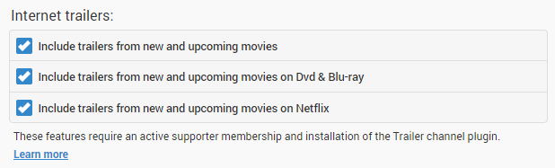

Cinema mode brings the theater experience straight to your living room with the ability to play trailers and custom intros before the main feature.

Cinema mode is configured in the server dashboard by navigating to **Playback** -> **Cinema Mode**. By default it is disabled.

## Choosing when to enable Cinema Mode

The configuration page allows you to choose the types of videos that will trigger cinema mode. Currently, Movies and Episodes are offered. A video is determined to be a Movie or Episode based upon the content type chosen when setting up the library.

## Local Trailers

If your movie folders contain local trailers, enabling this option will allow these trailers to be used within cinema mode.

## Internet Trailers

If your movie folders contain local trailers, enabling this option will allow these trailers to be used within cinema mode.

Note: This feature has two requirements:

* An active supporter membership. See http://mediabrowser.tv/donate/
* Installation of the [Trailer plugin](Plugins)