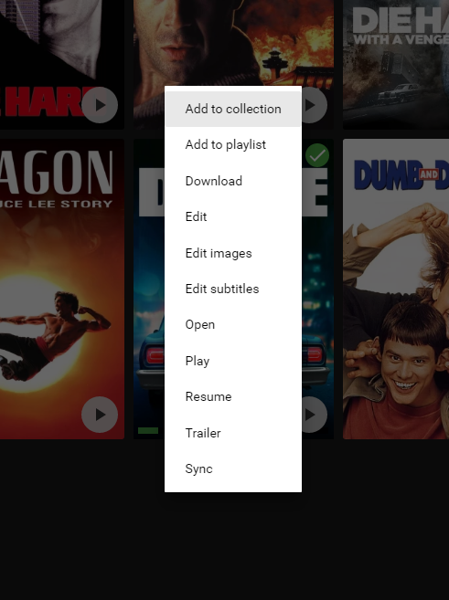
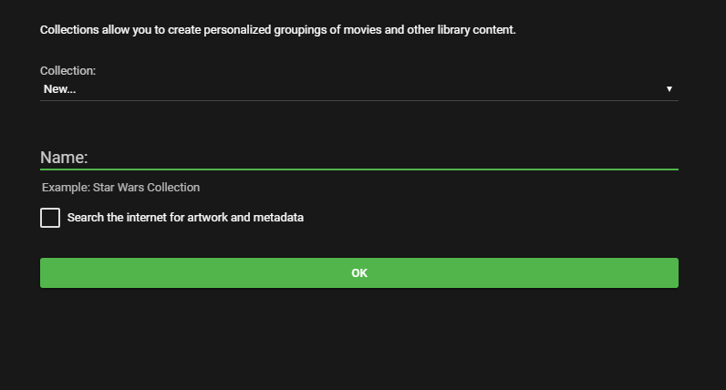

Collections are personalized groupings of library content. Collections are generally used to group movies together but can also be used for TV Series and other library content.

## How to Create a Collection

To create a collection, start with a Movie, Series, or any other item in your Emby library. Open the context menu for that item using one of the following methods:

* Right click on the poster
* Use the 3-Dot menu on the detail screen
* Mouse over the poster and use the 3-Dot menu

When the context menu appears, select "Add to Collection". You'll then be presented with a popup where you can add the item to an existing collection, or create a new one.

When creating a new collection, you can also enable searching the internet for artwork related to that collection. TheMovieDb.Org has artwork for Movie Collections, and if you give your collections the same name, then Emby server can automatically download Collection artwork.

An example name of a Collection is "Star Wars Collection".

## Browsing Collections

Collections are typically used for movies, and Emby apps have sections for Collections as part of their Movie views. No additional configuration is required to enable his.

If you would like to your Emby library to display a dedicated Collections menu, this can be enabled in user preferences.

Additionally if you'd like movies to be automatically grouped into their Collections when browsing your movie list, this can also be enabled in user preferences. To access user preferences, click your user icon in the main menu:

Then select Display Settings:

As an example, suppose you have a Star Wars Collection, and you have all 7 Star Wars movies. When browsing your movie list, by default you'll see all 7 titles. If instead you'd just like to see the Collection in place of all 7 movies, this can be enabled using the collection grouping setting.

## Adding Items to a Collection

To add individual items to a collection, use the method discussed above. If you'd like to add multiple items at once, you can do this with the multi-select tool.

To use the multi-select tool, simply click and hold on any poster (or tap and hold). When the multi-select menu appears, use the checkboxes to select the items you'd like to add.

Finally, select to "Add to Collection" within the mutli-select action menu.

**Tip**: The multi-select tool can also be used within search results.

## Removing Items from a Collection

To remove an item from a collection, first browse to the detail screen for that collection. Each item in the collection will have a 3-dot menu. 

To remove an item, click the 3-dot menu, then select "Remove from Collection".

