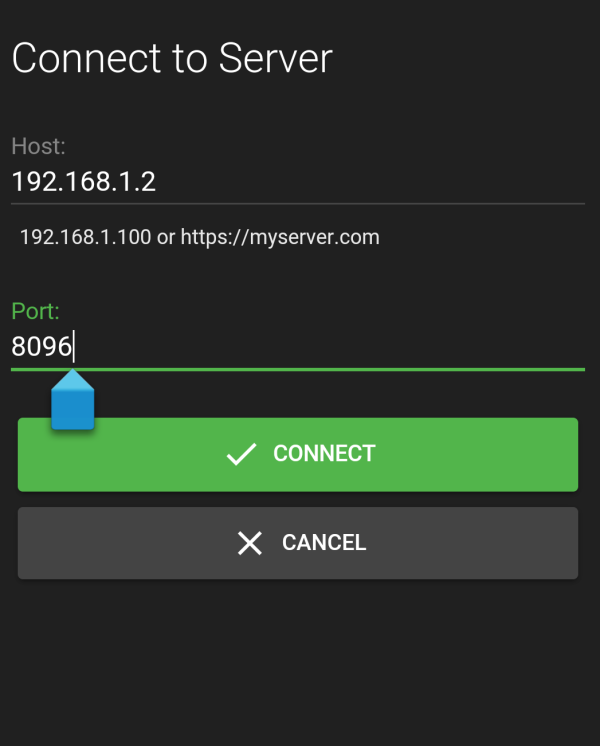

This purpose of this document is to discuss how to connect to Emby Server from additional devices, both within your home network and external. To learn how to grant users access to your server, see [Users](Users).

In most cases you won't need to do anything to connect to your server from other devices, as Emby apps are built to automatically know how to connect to it. But on some systems some manual configuration might be necessary. This document is primarily designed as for troubleshooting when the automatic features do not work.

# Internal Connections

Emby apps can automatically discover your Emby Server on your home network, so in most cases, there's nothing more you need to do. But in the event this does not work, you can still connect to your Emby Server by manually entering the server's address.

To locate your server's internal address, simply open the Emby Server Dashboard on the Emby Server machine, typically http://localhost:8096

Your Emby Server's local address is then displayed in the **Local address** field.

This information can then be entered into Emby apps:

# Troubleshooting Internal Connections

If the above still does not work, please ensure the machine running Emby Server is turned on, and that the Emby Server application is running.

A useful test is to try to use a web browser on another device, such as another computer, or a smartphone or tablet. You'll need to ensure the other device is connected to the same WIFI network. Try opening a web browser on that device and entering the local address manually:

If this still does not work, then most likely the firewall on the server machine is not allowing access.