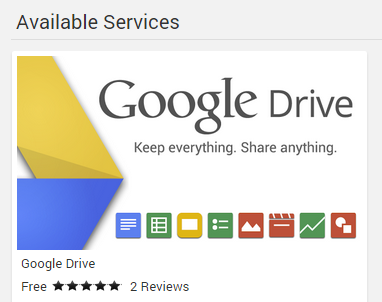

Cloud sync allows you to copy content to cloud storage accounts, for backup as well as archiving in multiple resolutions.

When content is archived in multiple resolutions, Emby apps will automatically choose the version that is most efficient for them. This will help relieve stress on your internet connection as well as your server's CPU. Apps will browse the content through your Emby Server as normal, but will stream from the cloud during playback.

## Installation

To install folder sync, open the **Emby Server Dashboard** and navigate to **Sync** -> **Services**. 

Click on Google Drive underneath **Available Services**.

Then proceed to install it on the installation page.

## Configuration

To configure Google Drive, open the **Emby Server Dashboard** and navigate to **Sync** -> **Services**.  Click on Google Drive underneath **Installed Services**. 

Configuring Google Drive is a two step process. 

### Create a Client Id and Secret

First you'll need to create a client Id and Secret. To do this, click on the link titled "Create a Google Drive Client Id and Secret". Follow the instructions in the popup message.