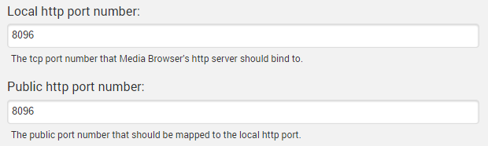
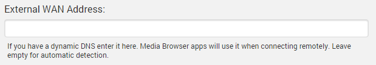
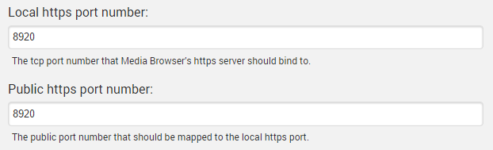
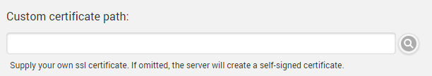
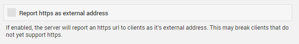
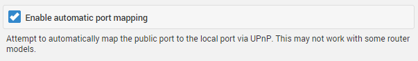

Hosting settings allow you to configure Emby's built-in web server. These settings are accessed by opening the server dashboard and navigating to **Advanced** -> **Hosting**.

For the purposes of this document we are defining local as within your home network, and external as outside your network away from home.

## Http Port

The http port settings allow you to specify both the local, system port that the server should bind to, as well as the external port that the server should use when reporting it's external url to clients.

Generally these two values will be the same, but they can be customized as needed.

## External WAN Address

The server will attempt to automatically detect your external address. The result is displayed on the front page of the server dashboard.

If for some reason you need to customize this value, or it is not detected properly, you can manually enter your external address here:

Most users can leave this blank and rely on the server's automatic detection. If you are using a DDNS, or the Https feature with a self-signed certificate, then you may prefer to customize it.

## Https Port

The local and public https ports can be configured in much the same way as regular http:

In addition you can also supply your own custom SSL certificate. This is highly recommended for https usage. If omitted, the server will create a self-signed certificate.

## Requiring Https

Emby apps use http by default. In order to force them to use https, you can configure the server to report it's default external url as the http url. 

**Note**: Https is a new feature. Some Emby apps may require updates before this option can be used.

## Automatic Port Mapping

By default the server will attempt to automatically map public to local ports by configuring your router. You can disable this as necessary here.

## Secure your server

This is a quick tutorial on how to secure your Emby server for free. If you are opening your server to the world, securing it is a good idea. It is also useful to provide required secured streams to external services such as Amazon Alexa or Google Home. If you are interested in an even more secure setup, here is a community-written guide on [HOW TO: NGINX Reverse Proxy](https://emby.media/community/index.php?/topic/47508-how-to-nginx-reverse-proxy/).

You'll need two things:
* A domain that supports TXT records
* A ssl certificate (PKCS #12)

#### Get your domain
Sign up for a free domain of your choice. You could use [Freenom](https://my.freenom.com/) or [Dynu](https://www.dynu.com/en-US/).

#### SSL certificate
We will now create Let's encrypt ssl certificates and add it to your domain. Here is a free service to help with this [SSL for free](https://www.sslforfree.com/).
1. Enter your domain on the site. i.e. yourdomain.com and create a free SSL certificate
2. Select Manual Verification (DNS) > Manually verify domain. We now have 2 TXT records (step 2 on the SSL for free website). We will copy back the TXT records to the domain provider. Leave the SSL for free page open. We will come back to it.

4. On the domain provider website, select your domain > Manage DNS. Let's create a new TX record. Repeat the steps for both TXT records on SSL for free. Your information should look like this.

   **Name**: _acme-challenge.{yourdomain.com}

   **Type**: TXT.

   **TTL**: 300 (if you can set it to 1, go for it).

   **Target**: qariKbGVafpb5MespqHdMaGi933yW-Z2A3shE0wIyZA

5. Wait about 15 minutes. Let the domain name and changes propagate.
6. Back to the SSL for free website. Look at step 3, you'll see a link or two to click. Click them. If it is successful, go ahead and click Download SSL certificate. If it is not successful, wait a little longer and retry.

#### Setup Emby with your domain and SSL certificate
Now you should have a domain and a folder of ssl certificate (ca_bundle.crt, certificate.crt, private.key).
We are almost done. Your Emby server requires a PKCS #12 certificate (certificate.crt and private.key combined).

1. Use this [online certificate converter](https://www.sslshopper.com/ssl-converter.html).
2. Select type to convert to: PKCS #12. This should expand the number of fields. Once completed, you'll get a new .pem certificate.

   **Certificate file**: certificate.crt

   **Private key**: private.key

   **Chain certificate**: Let's Encrypt [Intermediate certificate](https://letsencrypt.org/certs/lets-encrypt-x3-cross-signed.pem.txt). Save the text into a .txt file.

   **Chain certificate 2**: Let's Encrypt [Root certificate](https://letsencrypt.org/certs/isrgrootx1.pem.txt). Save the text into a .txt file.

   **PFX password**: Since the private key is combined with the certificate, set a password to secure the new ssl certificate. Remember this password, you'll need it in Emby.
3. Go to your Emby server dashboard > Advanced. Save your changes and restart your server.

   **External domain**: yourdomain.com

   **Custom SSL certificate path**: point to your new certificate.pem

   **Certificate password**: The password you set up in the previous step.

   **Secure connection mode**: Set it to Preferred but not required or Required for all remote connections.

Your dashboard should now reflect your remote access as https://yourdomain.com:port. If you followed all the steps, clicking the new remote url should reach your Emby server. If it doesn't work, verify your https ports and try connecting from outside of your network.

**Save all your certificate files and keys in safe location.** You'll need the private key when you are ready to renew your SSL certificate (I have my own CSR option on SSL for free).
Since this is all for free, it requires a bit more involvement. You will need to ensure you renew your SSL certificates (every 3 months with SSL for free) and your free domain (every year at least). If you used SSL for free, I suggest creating an account to make the renewal process easier.

