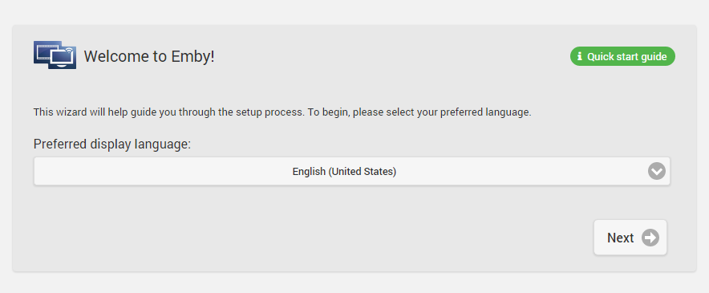
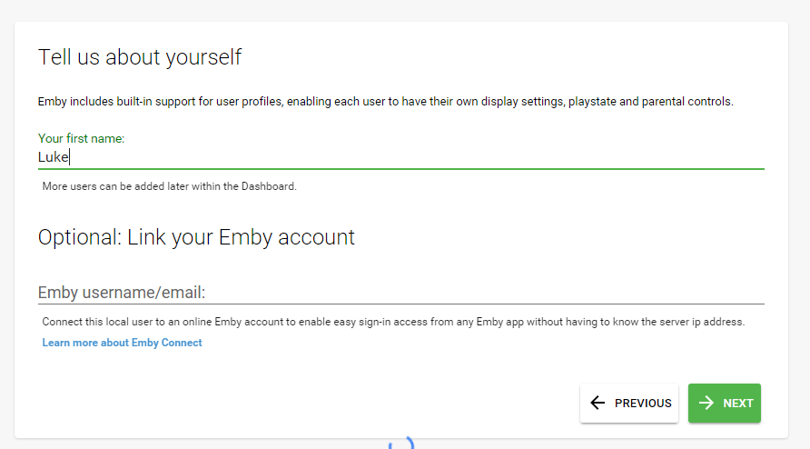
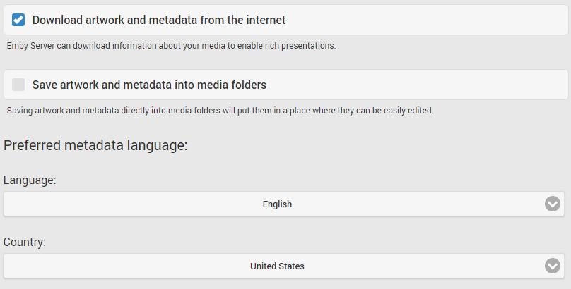
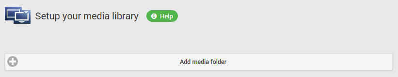

Emby Server is available on the following platforms:

* Windows
* Mac
* Linux
* BSD
* NAS Devices

To install Emby Server, begin by visiting the download page and following the instructions for your operating system:

http://emby.media/download/

## Running the Startup Wizard

After Emby Server has been installed, it will attempt to launch the startup wizard in your default browser. If this does not occur automatically, please open your web browser and navigate to:

[http://localhost:8096/web/wizardstart.html](http://localhost:8096/web/wizardstart.html)

### Language Selection

The first page will ask you to choose a display language. We have been working hard to translate Emby into as many languages as possible, and the available options are displayed on this page.

### Create a User

### Configure Settings

### Add Media Libraries

