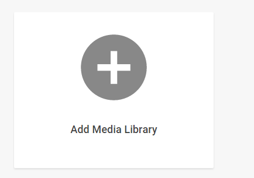
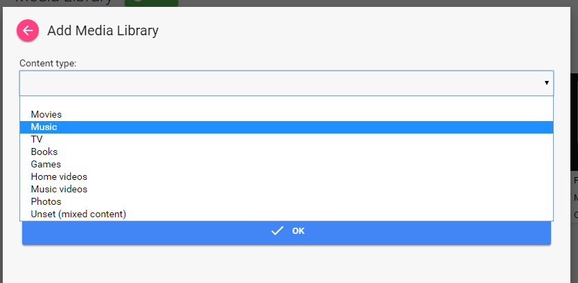
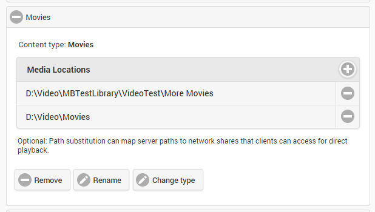
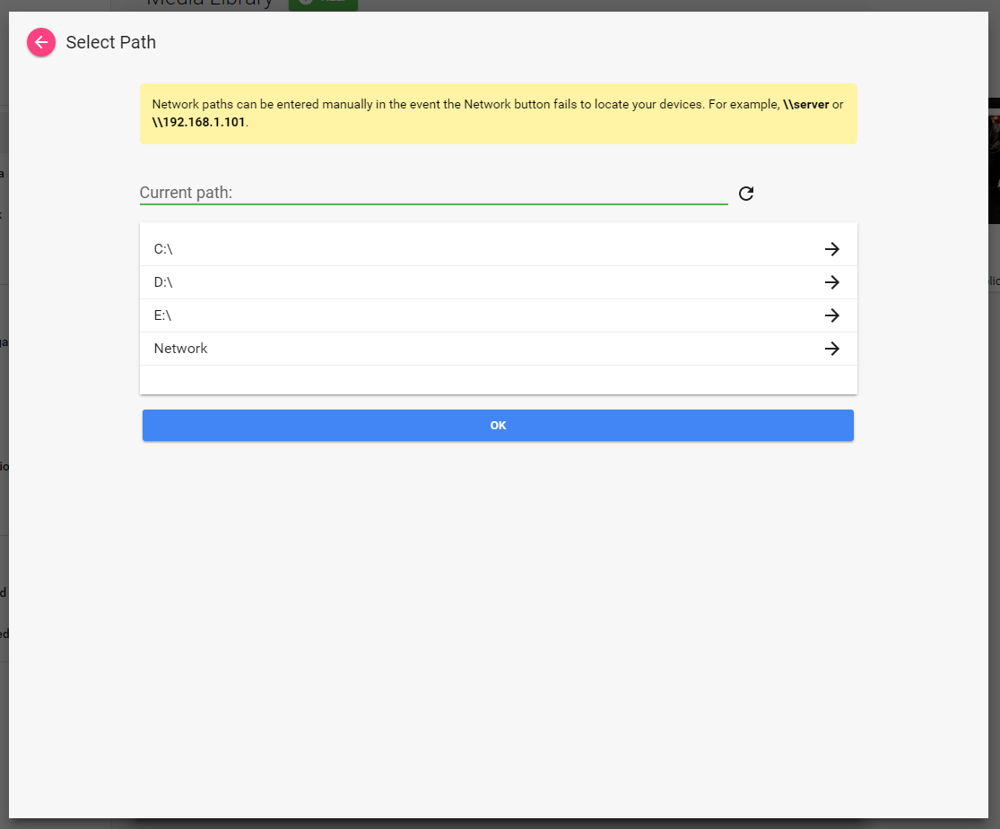

Setting up the library is handled within the startup wizard and also within the server dashboard, located by clicking on the **Library** tab.

### Prepare Your Media

It's important to first prepare your media. See other sections of the wiki for more information:

* [Movie naming](Movie naming)
* [TV naming](TV naming)
* [Music naming](Music naming)
* [Subtitles](Subtitles)

### Library Setup Page

The configuration will display the media folders you've configured and allow you to add, remove, rename or change the paths they're mapped to. 

> A media folder is a grouping of one or more physical folders on your file system.

The below example screenshot lists four media folders:



Clicking the "Add Media Folder" button will open a dialog to add a media folder, where you choose the content type and enter a name. 

### Content Type

Choosing the right content type is important. See the above guide on media preparation for best practices for Movie, TV and Music sections. Use the unset content type if you'd like to add a media folder that mixes different content. Please note that support for mixed content is very limited. 

You can also use the unset content type if you use a complex tv folder structure. An example of a complex tv structure is:

```
\TV\A-M\Glee
\TV\N-Z\Seinfeld
```
In the above example, the recommended setup is to create a TV media folder, and then add the **A-M** and **N-Z** library paths. Or the "TV" folder can be left to content type **unset**, and both the A-M and N-Z folders would be set to a content type of **TV**.



### Library Paths

Each media folder can have one or more physical library paths. In the below example screenshot, the Movies folder contains two physical paths:



To add a library path, click the + button. A popup will be displayed allowing you to browse to the location in a visual manner.

**Important Note**: On some networks the visual browser may fail to display network devices. If this occurs you can still complete the dialog by typing in the path manually and clicking OK.

