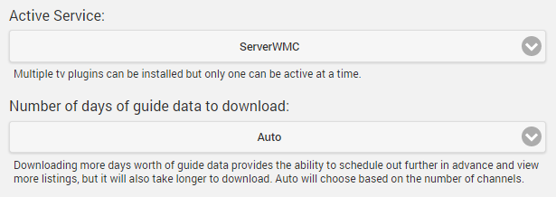

The Live TV feature allows you to stream live television and manage your DVR within Emby Apps. Live TV is setup in two steps:

* Configure your tuner devices
* Add a TV Guide data source

## Configure Your TV Tuner

Out of the box, Emby Server currently supports the following TV Tuners:

* HDHomerun (Dlna feature required)

Support for additional tuners can be added by installing a [Live TV Plugin](Live-TV-Plugins).

## Add a TV Guide Data Source

Out of the box, Emby Server currently supports the following TV Guide data sources:

* Schedules Direct

Support for additional sources can be added by installing a [Live TV Plugin](Live-TV-Plugins).

## Live TV Status

The status of your tv tuners is also displayed in the server dashboard by navigating to **Live TV**.

In addition, the reset button next to each tuner will allow you to reset the tuner as needed for troubleshooting.

There is also the ability to manually refresh Guide data. This is normally run automatically and it is generally not needed for manual use, but it is provided here as a convenience.

## Settings

The **Settings** tab allows you to configure how many days of guide data to download and display. More guide data provides a richer experience but may increase loading times.

