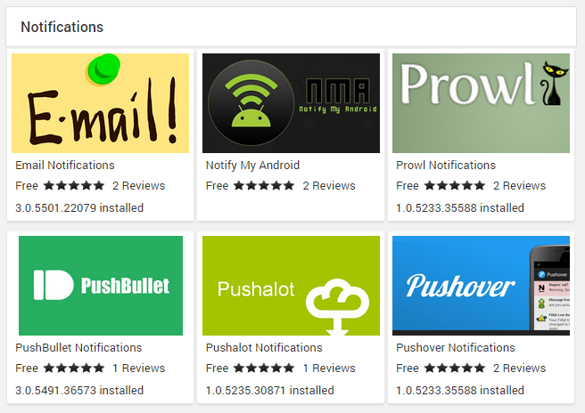

Server notifications allow you to stay informed of your server's activity.

## Notification Services

Notification services are the destinations that receive the notifications. Notification services are available for email, Android, iOS, Windows, and more. 

Out of the box the server includes one notification service, the built-in server dashboard notifications. Dashboard notifications appear in the top right-hand corner of the web interface:

The bubble shows 0 for no new notifications, and will change color as new ones are received:

To install new notification services, navigate to the Plugin Catalog and scroll down to the Notifications section. A number of options are available:

