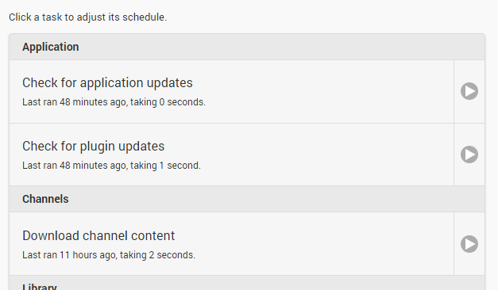

Scheduled tasks are system operations that need to run periodically in order to keep your server up to date and running smoothly. Many of them take too long to be run within the normal library scan, so that's why we make them available as configurable scheduled tasks.

Scheduled tasks are accessed from the server dashboard by navigating to **Advanced** -> **Scheduled Tasks**.

You'll be presented with a list of scheduled tasks, for example:

Tasks can be run on demand anytime by clicking the play button on the right hand-side. Clicking on a task will display the triggers that cause the task to run:

The available triggers are:

* Daily at set time
* Weekly at set day and time
* Interval (Based on a number of hours)
* At application startup
* When the server resumes from sleep