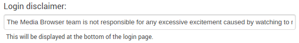

The server has several settings that can be used to customize how it presents itself to users.

- **Friendly server name**: used to set a custom name for your server. If no friendly name is set, the hostname of the computer will be used instead.
- **Preferred display language**: used to set the language for the server. Currently, many translations are works in progress. If you wish to contribute, please refer to the forums for more information.

## Advanced settings

Please do not make any changes to the settings in this area unless you are sure of what you are doing.

- **Local port number**: the port to which Media Browser will bind itself when it starts. This setting will affect how you access the server so do not change this setting unless you *know* what you are doing.
- **Public port number**: the port in your router needs to be forwarded to the **local port number** if you wish to access your server from outside your home network.
- **Automatic port mapping**: uses [Universal Plug and Play](https://en.wikipedia.org/wiki/Universal_Plug_and_Play) (UPnP) to automatically configure the port fowarding for you. Your router will need to support UPnP. Please refer to your router's manual to find out if it supports UPnP.
- **External DDNS**: for those who use a [dynamic DNS](https://en.wikipedia.org/wiki/Dynamic_DNS) address. Media Browser Connect will use the value in the external DDNS field to connect to your server so do NOT set this unless you have a properly configured dynamic DNS service on your computer.
- **Cache path**: set a custom cache path if you do not want the cache to be located in the server's default app data directory.

## Branding

The **Login disclaimer** can be used to display a custom message on the login screen of the web client.

