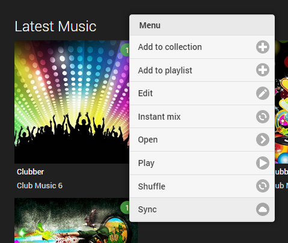
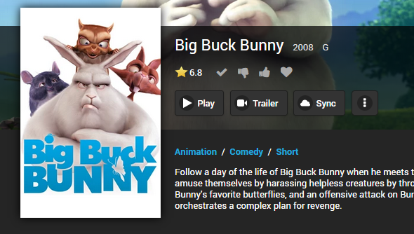
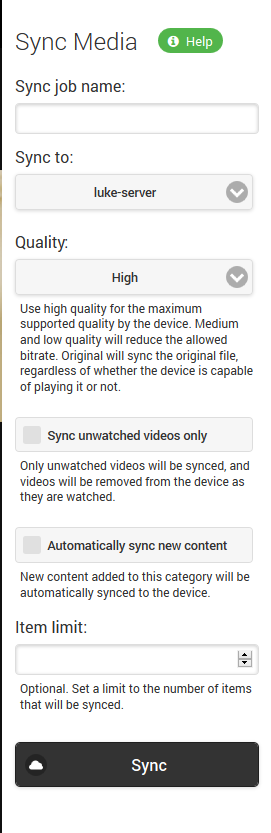
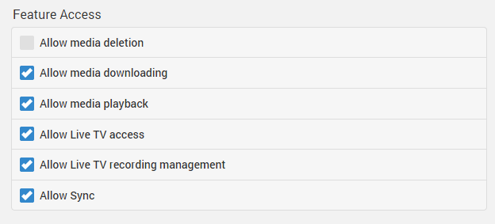

The sync feature allows you to copy your content to mobile devices for offline viewing. This is done by creating sync jobs using either the server's web interface or a Media Browser app on a mobile device. The server will then convert the media for the device as necessary. The apps will then sync the content by running a periodic background sync process.

The apps that currently support syncing are:

* **Windows 8.1**

The feature is coming soon to:

* **Android**
* **iOS**
* **Windows Phone**

## Creating Sync Jobs

Sync jobs can be created from a number of areas, including, syncing by categories:

Syncing from context menus:

Syncing from detail pages:

When creating sync jobs, you'll be able to configure various settings for the job. The settings that are available will differ depending on the content being synced. 

Some of the settings available are:

**Quality**

The desired quality level of the synced content. Higher produces better video quality but will require more storage space on the mobile device. The "Original" option can be used to force the process to utilize the original file, but this may result in the file not being playable on the device. 

**Unwatched Videos Only**

Only unwatched videos will be synced, and videos will be removed from the device as they are watched.

**Automatically Sync New Content**

New content added to the folder or category will be automatically synced to the device.

**Item Limit**

The maximum number of items that will be synced to the device at any given time.

## Managing Sync Jobs

Individual users can manage their own sync jobs using the main menu of the web interface:

Their list of sync jobs will be displayed visually:

Clicking on a sync job will display the job details and allow you to modify it's settings:

In addition, each item within the job can be managed as desired:

## User Access

Access to the sync feature can be managed individually for each user. 

For more information, see [Users](Users).