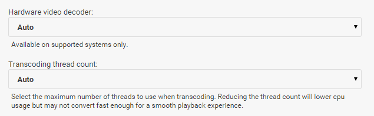
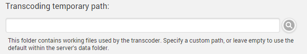

Emby has the ability to convert your media during playback in order to make it compatible with all of your devices. This process is known as transcoding.

In most cases, the server and the apps will automatically select the ideal settings to achieve smooth playback. In some cases though, you may choose to provide your own configuration in order to improve the playback experience.

## App Settings

Every Emby app will have a setting known as "Max streaming bitrate". This is the most important setting to configure within the app that you're trying to use, and will have the greatest effect on image quality. As you increase the bitrate quality will improve, but will require a faster connection between the device and server.

# Server Settings

In addition, the server has some transcoding settings that can be configured. These are found by opening the server dashboard and navigating to **Playback** -> **Transcoding**.

The **hardware video decoder setting** allows the use of Intel QSV hardware decoding. This should only be enabled if you have the appropriate hardware and may result in errors otherwise. If you're unsure, leave the setting at Auto and the system will attempt to automatically detect this.

The **thread count setting** allows you to specify how many processors to allocate to each transcoding job. In almost all cases, this should be left to Auto as the system will adapt based on current conditions.

## Temporary Path

The server will need to create temporary files throughout the transcoding process. The location of these files can be configured.

If you specify a custom path, please ensure the following conditions are met:

* The folder is writable
* The folder is not used for any other purpose, as the server will delete all contents to keep it clean.

## Audio Boost

When surround audio is converted to 2-channel stereo audio, this often results in a lower volume level. To offset this, you can configure an audio boost scale factor to increase the volume.

The default value is **2**, meaning the volume will be doubled when converting surround audio to stereo.