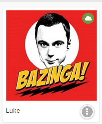
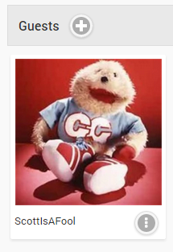
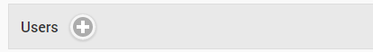
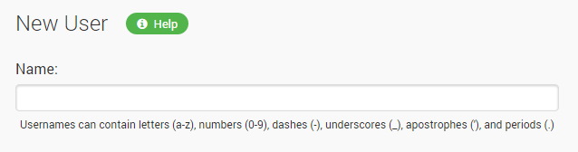
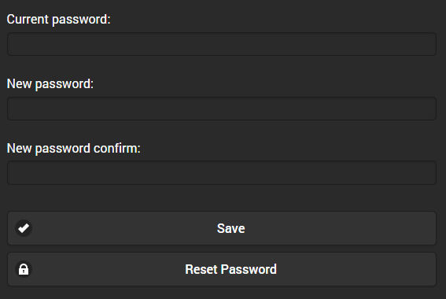
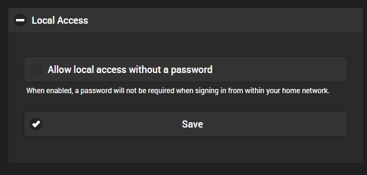

Most operations within Media Browser are based around users. Users can have their own personalized media libraries, user data, recommendations, security settings, and more.

Users are managed within the server dashboard by navigating to **Users**. The page will display as many as three kinds of users: Local Users, Guests and Pending Invitations.

## Local Users

Local users are displayed under the user heading. These are users that you've created in the server dashboard.

A local user will be displayed with a cloud if it is linked to [Media Browser Connect](Media Browser Connect). 

Linking a user to Media Browser Connect will enable an easier sign in process that doesn't require the user to know your server's ip address. For more information, see [Media Browser Connect](Media Browser Connect).

## Guests

Guests are users that you've invited using [Media Browser Connect](Media Browser Connect). By default Guests have limited permissions but administrators can easily control this to give them access to various features as desired.

## Pending Invitations

Guests that you've invited will display as pending until they accept the invitation. 

Invitations can easily be cancelled by clicking the dot menu button:

## Adding a User

To add a local user, click the + button within the Users heading:

You'll then be taken to the new user page page. The only required field is a user name:

In addition you can also configure library and channel access, and this can easily be changed later:

## User Password

By default, users have the ability to change their own passwords, so this function is handled in areas that don't require administrative access. If you would like to change the password for a user, navigate to the server dashboard -> **Users** -> **Click User** -> **Password**.

Click Configure Password. You will then be taken to the user-facing side of the web interface where you can change or the password.

**Note**: Guest passwords are managed by Media Browser Connect and can only be changed by the user themselves.

### Local Access

If a password is configured, you can choose to allow in-network access without the use of a password.

Note: Enabling this option may introduce security risks. Incoming ip addresses can be spoofed, therefore there is no way for the server to determine with 100% accuracy that the request is coming from inside your home network.

## Deleting a User

To delete a user or guest, simply click the dot menu button and select Delete:

